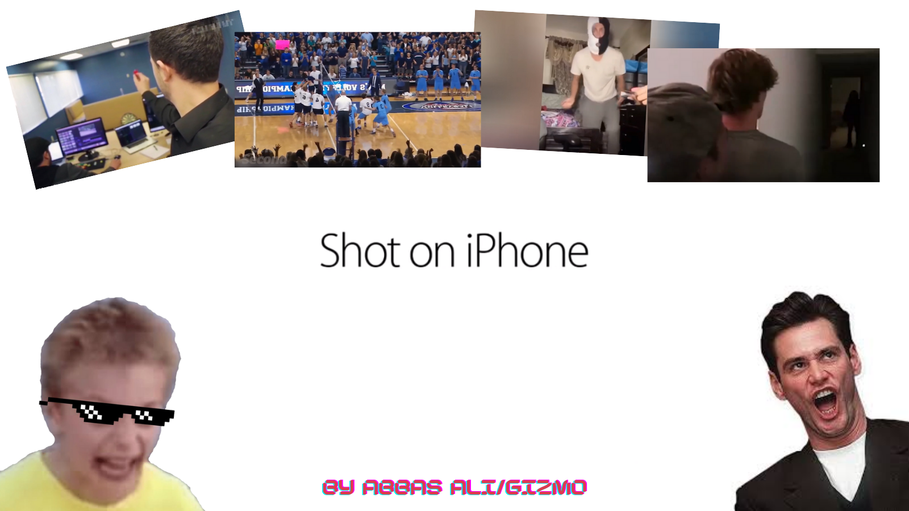

# shot-on-iphone-api
You've seen them on Instagram, Facebook, Twitter. Shot On Iphone.studio is the place to go to see all the best Shot On Iphone memes!. You can also use our Shot on iPhone api to create your own shot on iPhone meme app

<!-- PROJECT LOGO -->
 

  

  <h3 align="center">Shot on Iphone Studio</h3>

  

    <samp>A free restful API serving shot on iphone memes</samp>
     
    <a href="https://shot-on-iphone.studio/"><strong>Explore the api »</strong></a>
     
     
    <a href="https://shotoniphone.docs.apiary.io/#">Docs</a>
    ·
    <a href="https://github.com/gizmo-dev/shot-on-iphone-api/issues">Bug report</a>
    ·
    <a href="https://github.com/gizmo-dev/shot-on-iphone-api/issues">Feature request</a>
  

 

### Techstack

* [express.js](https://expressjs.com/) - api is written in express.js
* [HTML5/CSS](https://developer.mozilla.org/en-US/docs/Glossary/HTML5) - Basic Frontend is used in laying out the website
* [TailwindCSS](https://tailwindcss.com/) - Tailwind is used for styling

> The api is hosted on Microsoft Azure and is available for free.

 

### About

You've seen them on Instagram, Facebook, Twitter. Shot On Iphone.studio is the place to go to see all the best Shot On Iphone memes!. You can also use our Shot on iPhone api to create your own shot on iPhone meme app

 

<!-- CONTRIBUTING -->
### Contributing

- For any bug or feature requests, [Submit a issue here](https://github.com/gizmo-dev/shot-on-iphone-api/issues).

Also please see the [open issues](https://github.com/gizmo-dev/shot-on-iphone-api/issues) for a list of proposed features before submitting one.

 

<!--Contact-->
### Contact

 

 

### Support

If you use the api in your projects then consider showing some support with a cup of coffee.

[buymeacoffee-shield]: https://www.buymeacoffee.com/assets/img/guidelines/download-assets-sm-1.svg
[buymeacoffee]: https://www.buymeacoffee.com/gizmoxgg
[![Buy me a coffee][buymeacoffee-shield]][buymeacoffee]

 

<!-- LICENSE -->
### Copyright

<a href="https://shot-on-iphone.studio">© 2021 shot-on-iphone.studio</a> | shot-on-iphone.studio is not affiliated with Apple

